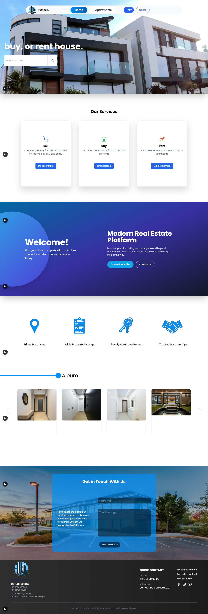
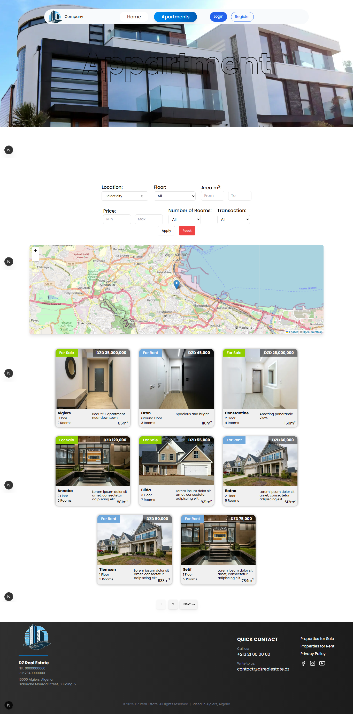
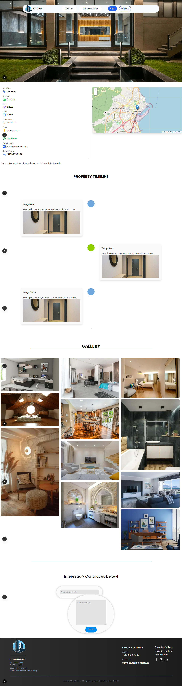
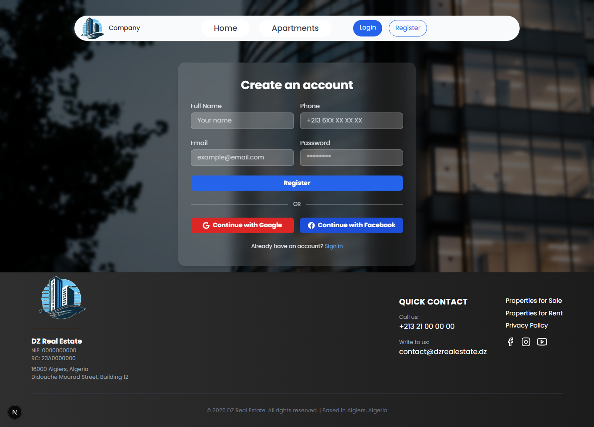
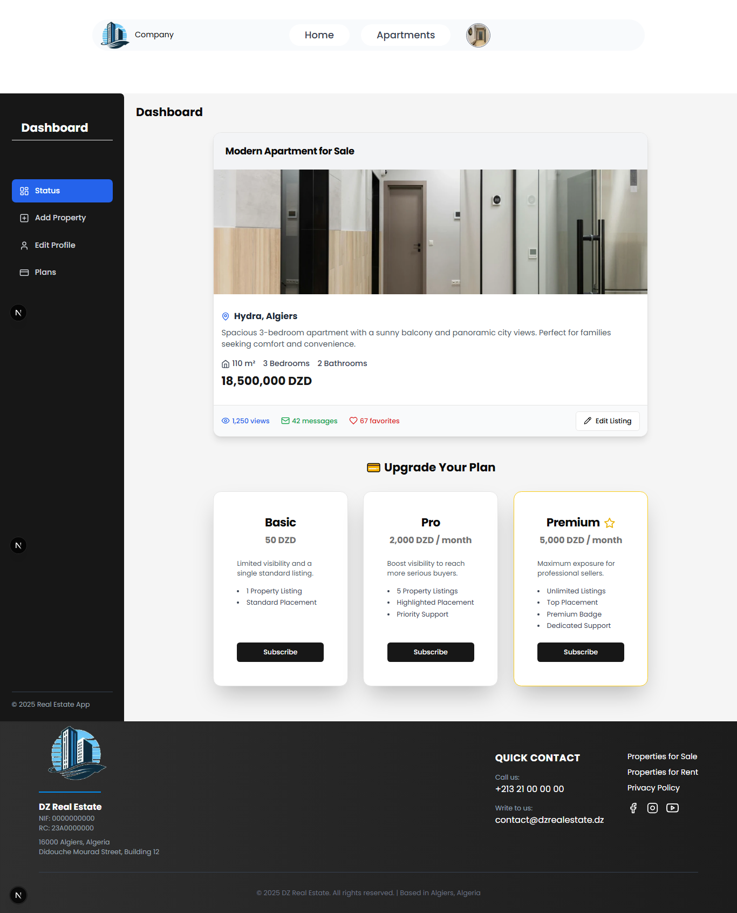

🏠 Real Estate Platform

This project is a real estate web application built to make it easier for users to buy, sell, and rent properties of all types — apartments, houses, offices, and more. The platform is designed with a clean, modern UI and a focus on functionality and user experience.

🌍 Main Features

Attractive Home Page: Includes featured offers and quick filters for different property types.

Advanced Search: Search by price, size, number of rooms or floors, and transaction type (buy or rent).

Property Listings: A beautiful grid of property cards showing images, prices, and key details.

Map-Based Search: Find properties directly through an interactive map.

Add Property Page: Post a property for sale or rent with full details and contact info.

Dashboard for Admins:

Manage user accounts.

Approve or reject property posts.

Delete or ban users.

Edit or update property listings.

Track ad performance and view counts.

Paid Advertisement System: Boost visibility for premium listings.

🧩 Tech Stack

React.js

Next.js

TypeScript

Tailwind CSS

💡 Learning Experience

This project was a major step in my frontend development journey, allowing me to apply what I’ve learned in React, TypeScript, and responsive design.
I practiced component structuring, state management, and UI optimization using Tailwind CSS.

Future Improvements:

Add a real-time chat between users.

Implement property ratings and reviews.

Enhance the mobile version for a fully responsive experience.

📸 Screenshots

🏠 Home Page

🏢 Apparments for rent or sell

🏢 Apparments Details Click

🔐 Login / Register Page

📊 Dashboard 

 👨‍💻 Developer
 Boudina Boubaker
 
💼 LinkedIn : https://www.linkedin.com/in/boubaker-boudina-874253147/

🌐 Portfolio : https://my-portfolio-three-theta-30.vercel.app/

📧 Email: boubkerboudinadev@email.com
